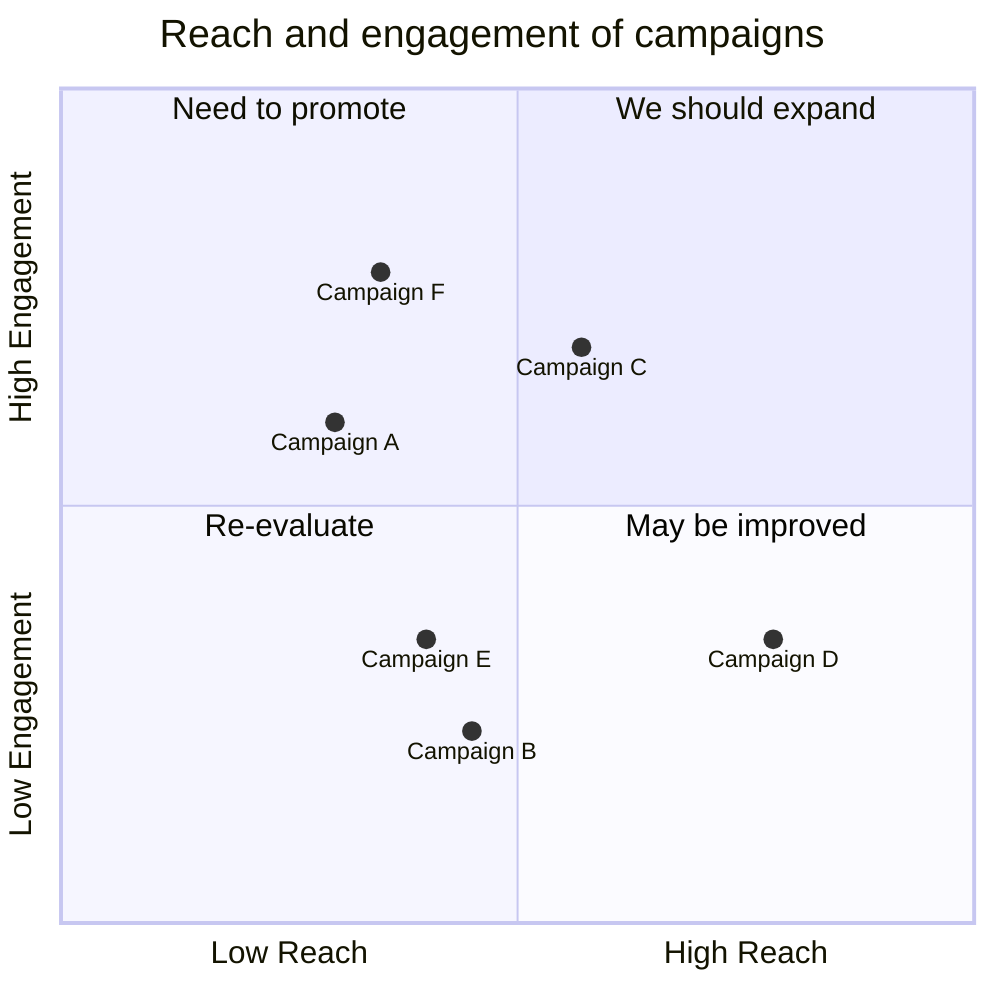
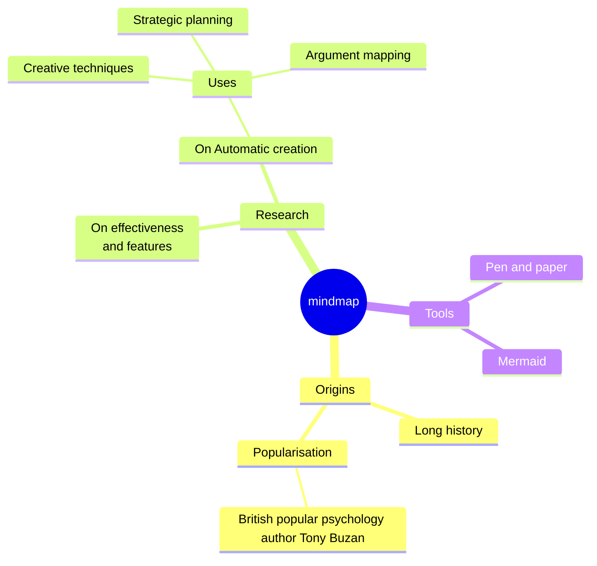

## Heading 2

### Heading 3

#### Heading 4

## Information Panels

:::note
Some **content** with *Markdown* `syntax`. Check [this `api`](#).
:::
:::tip
Some **content** with *Markdown* `syntax`. Check [this `api`](#).
:::
:::info
Some **content** with *Markdown* `syntax`. Check [this `api`](#).
:::
:::warning
Some **content** with *Markdown* `syntax`. Check [this `api`](#).
:::
:::danger
Some **content** with *Markdown* `syntax`. Check [this `api`](#).
:::

## Code Blocks

```jsx
function HelloCodeTitle(props) {
  return <h1>Hello, {props.name}</h1>;
}
```

## Mermaid Diagrams





